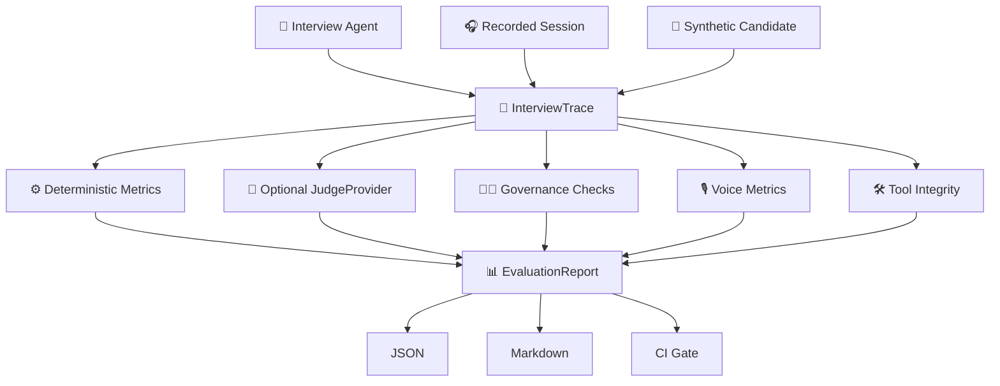
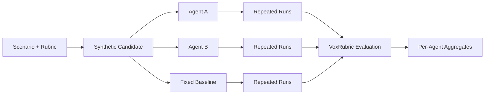
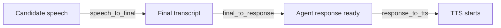
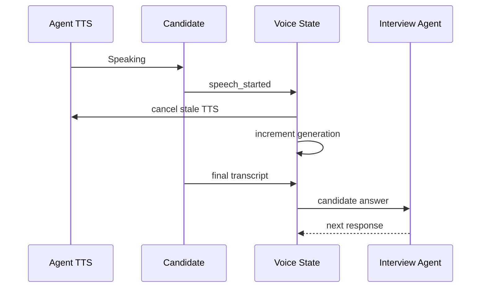
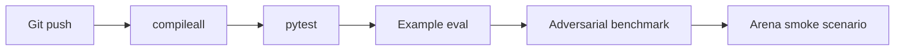

# 📊 VoxRubric

<p align="center">
  <strong>Evidence-grounded evaluation, regression testing, and Arena benchmarking for AI interview & voice agents.</strong>
</p>

<p align="center">
  Measure the interview system — not just the final score.
</p>

<p align="center">
  
  
  
  
  
  
  
</p>

<p align="center">
  <a href="#-why-voxrubric">Why</a> ·
  <a href="#-metric-suite">Metrics</a> ·
  <a href="#-arena">Arena</a> ·
  <a href="#-architecture">Architecture</a> ·
  <a href="#-quick-start">Quick Start</a> ·
  <a href="#-benchmarking">Benchmarking</a> ·
  <a href="#-roadmap">Roadmap</a>
</p>

---

## 🌟 What is VoxRubric?

**VoxRubric** is an open-source evaluation toolkit for AI interview and voice agents.

It tests whether an agent:

- covers the intended rubric;
- grounds evidence in real transcript turns;
- follows up traceably;
- preserves candidate controls and rights;
- handles practical tools safely;
- behaves consistently across repeated runs;
- supports Arabic/English code-switching;
- stays responsive in realtime voice interactions;
- recovers correctly after barge-in;
- produces inspectable evaluation artifacts.

VoxRubric deliberately avoids collapsing all behavior into one “magic quality score”.

> Different failure modes remain different metrics.

---

## 💡 Why VoxRubric?

A production interview agent can fail even when its final score looks plausible.

Examples:

- ❌ required competency skipped;
- ❌ follow-up not actually linked to the candidate answer;
- ❌ fabricated evidence quote;
- ❌ judges disagree materially;
- ❌ hidden practical-test data leaks;
- ❌ manual-review artifact still receives a fake automatic score;
- ❌ candidate asks for thinking time and the agent mishandles it;
- ❌ STT is fast but reasoning latency makes voice unusable;
- ❌ TTS continues after the candidate interrupts;
- ❌ identical repeated scenarios produce unstable interview paths.

VoxRubric turns these into explicit, machine-testable behaviors.

---

# 🧭 Design principles

| Principle | Meaning |
|---|---|
| 🧾 **Evidence before scores** | High-stakes claims should trace back to actual turns or artifacts |
| 🧩 **Separate metrics** | Coverage, latency, grounding, governance, and voice remain distinct |
| 🔌 **Provider-neutral** | Hosted/local/external models connect through small interfaces |
| ⚙️ **Deterministic first** | Structural failures are caught before expensive judge calls |
| 🌍 **Arabic + English first-class** | Code-switched technical speech is part of the test model |
| 🧑‍⚖️ **Human decision ownership** | VoxRubric evaluates systems, not people autonomously |
| 🧪 **Regression-oriented** | Known-bad traces should fail for known reasons |
| 🏟️ **No automatic winner** | Arena reports measurements without universal ranking |

---

# 📐 Metric suite

## Core metrics

| Metric | Purpose |
|---|---|
| `evidence_grounding` | Are cited quotes present in the referenced transcript turn? |
| `rubric_coverage` | Were required dimensions covered? |
| `follow_up_integrity` | Do follow-ups point to real candidate answers? |
| `response_latency` | p50 / p95 / max interviewer latency |
| `code_switching` | Arabic/Latin code-switching in candidate turns |
| `judge_agreement` | Cross-judge normalized score agreement |

## Governance & evidence

| Metric | Purpose |
|---|---|
| `dual_lane_balance` | Anchor/adaptive interview balance |
| `evidence_provenance` | Evidence points to valid turns with valid provenance |
| `semantic_judge_integrity` | Literal quote grounding, transcript-state limits, and judge failure audit |
| `governance_audit` | Corrections, appeals, and review-only integrity signals |
| `candidate_control_recovery` | Repeat/clarify/thinking-time/resume/correction handling |

## Practical tools

| Metric | Purpose |
|---|---|
| `tool_artifact_integrity` | Tool lifecycle, artifact lineage, manual-review semantics, hidden-data leakage |

## Realtime voice

| Metric | Purpose |
|---|---|
| `voice_event_integrity` | Valid speech/TTS lifecycle ordering |
| `voice_latency_breakdown` | STT finalization, reasoning, TTS startup, end-to-end p95 |
| `barge_in_recovery` | Does interruption cancel stale audio and recover correctly? |

---

# 🏗️ Architecture

## Evaluation pipeline



## Evaluation philosophy

```text
cheap structural checks
        ↓
trace invariants
        ↓
governance / provenance
        ↓
optional semantic judge
        ↓
report
```

Structural failures should be caught before invoking a semantic model.

---

# 🏟️ Arena

**VoxRubric Arena** runs the same controlled scenario and synthetic candidate against multiple interview-agent adapters.



Arena currently supports:

- deterministic synthetic candidates;
- repeated runs;
- scripted baseline agents;
- provider-neutral agent adapters;
- completion/turn aggregates;
- question-path stability;
- ordinary VoxRubric metrics for every generated trace.

### Important

Arena **does not**:

- select a universal winner;
- produce a single combined quality score;
- claim synthetic candidates represent all real candidates.

It reports descriptive measurements and leaves weighting decisions to the researcher/operator.

See [docs/ARENA.md](docs/ARENA.md).

---

# 🎙️ Realtime voice evaluation

VoxRubric decomposes conversational voice latency.



This helps identify where voice interaction is slow:

- STT finalization;
- agent reasoning;
- TTS startup.

### Barge-in recovery

A successful interruption path looks like:



VoxRubric can check whether the lifecycle is structurally complete.

---

# 🛠️ Tool & artifact integrity

VoxRubric understands practical interview artifacts such as:

- coding;
- case studies;
- documents;
- whiteboards;
- datasets.

It validates invariants including:

- submission references a real tool;
- evaluation references the correct submission;
- evaluated tool has an evaluation;
- manual-review artifact does not receive an automatic score;
- public payload does not leak private evaluation data.

Forbidden public keys include patterns such as:

```text
hidden_tests
private_tests
answer_key
expected_solution
gold_solution
```

---

# 🧑‍⚖️ Governance-aware evaluation

For Nora-style traces, VoxRubric can inspect:

- semantic judge evidence and failures;
- literal semantic quote grounding;
- transcript semantic overclaiming (`verified`);
- candidate transcript revisions;
- candidate appeals;
- integrity signals;
- evidence provenance;
- candidate controls;
- tool lifecycle;
- realtime voice lifecycle.

Product-specific metrics return **non-applicable** when the relevant metadata is absent rather than inventing a failure.

---

# 🧾 Trace model

A minimal turn:

```json
{
  "id": "q2",
  "speaker": "interviewer",
  "text": "What evidence told you the event loop was blocked?",
  "parent_turn_id": "a1",
  "response_latency_ms": 780,
  "rubric_tags": ["concurrency", "debugging"]
}
```

An evidence-bearing scorecard:

```json
{
  "dimension": "debugging",
  "score": 8.0,
  "evidence": [
    {
      "turn_id": "a2",
      "quote": "event-loop lag with database query duration",
      "rationale": "The candidate compared competing hypotheses using measurements."
    }
  ]
}
```

---

# 🧪 Benchmarking

A benchmark suite contains traces plus **expected evaluator behavior**.

The goal is not to make every trace pass.

A strong evaluator must fail known-bad traces for the right reason.

Bundled adversarial cases cover:

- fabricated evidence;
- missing competency coverage;
- broken follow-up lineage;
- excessive latency;
- bilingual/code-switched control traces.

See [docs/BENCHMARKING.md](docs/BENCHMARKING.md).

---

# 🚀 Quick start

## Requirements

- Python **3.11+**

## Install

```bash
git clone https://github.com/Mahmoud-Shabana/voxrubric.git
cd voxrubric

python -m pip install -e '.[dev]'
pytest
```

## Evaluate a trace

```bash
voxrubric eval \
  --trace examples/session.json \
  --rubric examples/python_engineer.yaml \
  --out report.md
```

## Run adversarial benchmark suite

```bash
voxrubric benchmark \
  benchmarks/adversarial/suite.yaml \
  --out benchmark-result.json
```

## Run Arena

```bash
voxrubric arena \
  examples/arena.yaml \
  --out arena-result.json
```

---

# 🐍 Python API

```python
from voxrubric import default_evaluator
from voxrubric.config import load_rubric, load_trace

trace = load_trace("examples/session.json")
rubric = load_rubric("examples/python_engineer.yaml")

report = default_evaluator(
    latency_budget_ms=1800
).run(trace, rubric)

for metric in report.metrics:
    print(
        metric.metric,
        metric.value,
        metric.passed,
    )
```

---

# 🔌 Provider-neutral interfaces

## Semantic judge

```python
class JudgeProvider(Protocol):
    @property
    def judge_id(self) -> str: ...

    def score(
        self,
        trace: InterviewTrace,
        rubric: Rubric,
    ) -> InterviewScorecard: ...
```

Reference hosted adapter:

```bash
python -m pip install -e '.[hosted]'
```

```python
from voxrubric.providers import OpenAICompatibleJudgeProvider

judge = OpenAICompatibleJudgeProvider(
    base_url="https://provider.example/v1",
    model="judge-model",
    api_key="...",
)
scorecard = judge.score(trace, rubric)
```

The adapter rejects unknown or duplicate rubric dimensions and requires every evidence quote to be a literal substring of the referenced candidate turn.

## Arena agent adapter

```python
class InterviewAgentSession(Protocol):
    async def start(
        self,
        *,
        role,
        rubric,
        locale,
    ) -> AgentUtterance: ...

    async def respond(
        self,
        candidate_text: str,
    ) -> AgentUtterance: ...


class InterviewAgentFactory(Protocol):
    @property
    def agent_id(self) -> str: ...

    def create(self) -> InterviewAgentSession: ...
```

---

# 🌍 Arabic + English

Arabic/English technical code-switching is represented as a first-class test condition.

Example:

```text
اشتغلت على FastAPI service وكان عندنا blocking database calls
بتأخر الـ event loop...
```

Current support includes structural code-switch detection and deterministic mixed-language fixtures.

Future benchmark packs will target:

- ASR preservation;
- Arabic technical vocabulary;
- dialect variation;
- semantic consistency across code-switching;
- follow-up robustness.

---

# 🗃️ Project structure

```text
voxrubric/
├── src/voxrubric/
│   ├── models.py                # Trace / rubric / metric contracts
│   ├── runner.py                # Default evaluator
│   ├── cli.py                   # CLI
│   ├── judging.py               # Judge ensembles
│   ├── synthetic.py             # Deterministic synthetic candidates
│   ├── benchmark.py             # Benchmark execution
│   ├── benchmark_models.py      # Benchmark schema
│   ├── arena.py                 # Multi-agent Arena runner
│   ├── arena_agents.py          # Baseline adapters
│   ├── arena_config.py          # YAML Arena loader
│   └── metrics/
│       ├── evidence.py
│       ├── coverage.py
│       ├── followups.py
│       ├── latency.py
│       ├── agreement.py
│       ├── codeswitch.py
│       ├── lanes.py
│       ├── provenance.py
│       ├── governance.py
│       ├── controls.py
│       ├── tools.py
│       └── voice.py
├── benchmarks/
│   └── adversarial/
├── examples/
│   ├── arena.yaml
│   └── arena_demo.py
├── tests/
├── docs/
└── pyproject.toml
```

---

# 🔁 CI & regression workflow



CI is designed to catch both ordinary code regressions and evaluator-behavior regressions.

---

# 📚 Documentation

- [Benchmarking](docs/BENCHMARKING.md)
- [Arena Methodology](docs/ARENA.md)
- [Nora Interviewer](https://github.com/Mahmoud-Shabana/nora-interviewer)

---

# 🗺️ Roadmap

## ✅ Implemented

- [x] evidence-grounding checks
- [x] rubric coverage
- [x] follow-up integrity
- [x] latency metrics
- [x] code-switch detection
- [x] judge agreement
- [x] dual-lane balance
- [x] evidence provenance
- [x] semantic judge integrity
- [x] literal quote provenance checks
- [x] governance audit
- [x] candidate-control recovery
- [x] tool-artifact integrity
- [x] realtime voice lifecycle integrity
- [x] voice latency breakdown
- [x] barge-in recovery
- [x] adversarial benchmark suites
- [x] deterministic synthetic candidates
- [x] repeated-run path stability
- [x] multi-agent Arena
- [x] YAML Arena scenarios
- [x] CLI support
- [x] CI smoke regression for benchmarks and Arena

## ✅ Recently completed on main

- [x] hosted-model JudgeProvider reference adapter
- [x] statistical confidence intervals for Arena metric aggregates
- [x] HTML comparison reports
- [x] Nora Arena adapter

## 🧭 Next

- [ ] local-model JudgeProvider reference adapter
- [ ] semantic follow-up quality evaluator
- [ ] multi-judge semantic evidence disagreement analysis
- [ ] ASR-preservation benchmark pack
- [ ] richer role/domain benchmark packs
- [ ] versioned benchmark dataset + dataset cards
- [ ] external interview-agent adapters beyond Nora

---

# 🔐 Safety & high-stakes use

VoxRubric should not infer or score:

- race;
- religion;
- nationality;
- disability;
- age;
- gender;
- health;
- facial expression;
- attractiveness;
- accent prestige;
- other protected/sensitive traits.

It is infrastructure for evaluating systems.

It is **not** an autonomous hiring authority.

---

# 🤝 Contributing

Useful contribution areas include:

- evaluation metrics;
- benchmark design;
- voice-agent testing;
- interview-agent adapters;
- Arabic/English ASR evaluation;
- adversarial datasets;
- reproducibility tooling;
- reporting and visualization.

A new metric should answer:

> What concrete system behavior does this measure, and what failure should it catch?

---

# 📄 License

Apache-2.0.

See [LICENSE](LICENSE).

---

<p align="center">
  <strong>VoxRubric</strong><br>
  Evidence before scores. Measurements before rankings.
</p>
